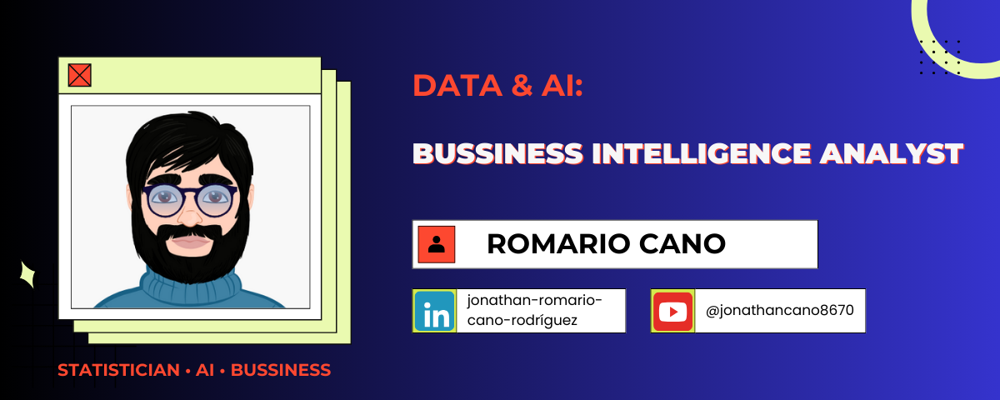

<h2 align="left">Hi 👋! My name is Jonathan Romario Cano Rodríguez and I'm a Statistician specialized in Business Intelligence, currently in Brazil.</h2>

###

  
  
  

###

###

  
  
  
  
  
  
  
  
  
  
  
  
  
  
  

###

<h3>💻 About Me:</h3>
  - 📊 Statistician specialized in **Business Intelligence** and Data Analysis.  
  - 🐍 Python enthusiast with projects in **Machine Learning** and **Data Visualization**.  
  - 📊 Experienced with **R Studio** for statistical modeling.  
  - 💡 Passionate about turning data into actionable insights.

###
✨ *Feel free to explore my repositories and reach out to collaborate!* 🚀
